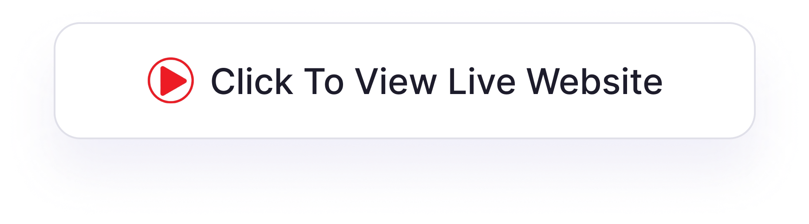

# Travel Agency Landing Page 🌍

## 

This is a fully responsive travel agency landing page built with **HTML**, **CSS**, and **JavaScript**. The design showcases a professional and user-friendly interface, providing essential features for booking tours, exploring destinations, and viewing testimonials.

### Features
- **Hero Section** with a captivating headline and call-to-action buttons.
- **Best Services** section highlighting key offerings like guided tours, flights, and medical insurance.
- **Tour Packages** with eye-catching visuals and details about popular destinations.
- **Testimonials** slider showcasing client reviews.
- **Footer Section** with navigation links and a subscription form.

### Tools & Technologies
- **HTML5** for semantic structure.
- **CSS3** for responsive and attractive styling.
- **JavaScript** for interactivity, including sliders and animations.

### Highlights
- Responsive layout for seamless viewing across all devices.
- Professional travel-themed design with high-quality images.
- Modern UI/UX to enhance the user experience.

### 💼 Contact me 
- linkedin. [Linkedin](https://www.linkedin.com/in/adityamamta/)
- Email: adityamamta4@gmail.com

<!--  -->
